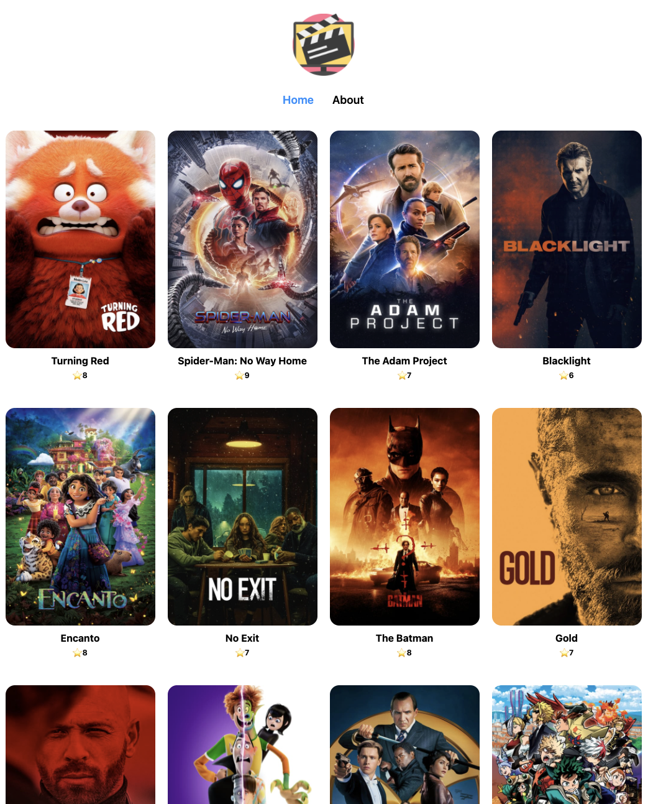
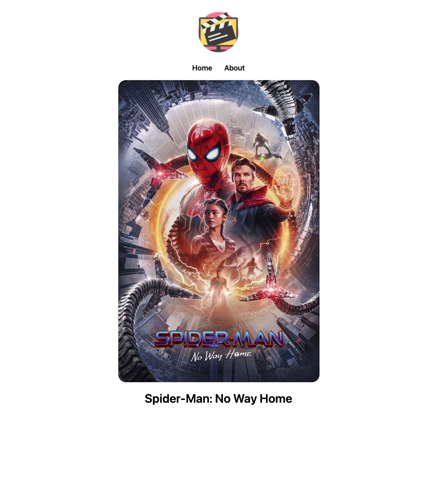

# NextJS-Movie-App

## 🔗 Demo

## 🖥 Preview

## 🔥 Stack

### Front-end

 

## ✅ Packages

- [x] React
- [x] Typescript
- [x] NextJS

## 📖 Theory

- [x] Styles
- [x] Pages
- [x] Fetching
- [x] Redirects
- [x] Rewrites
- [x] Dynamic URLs
